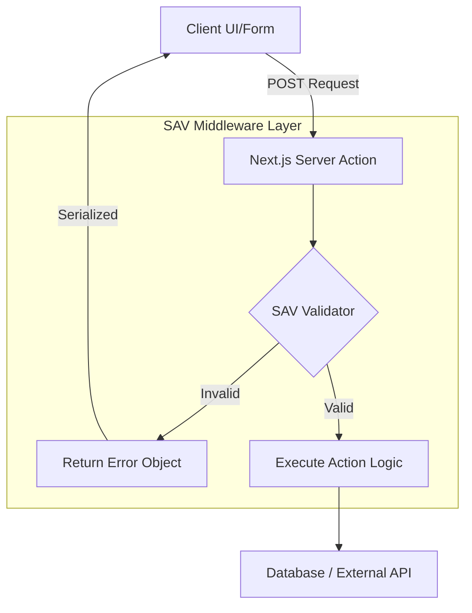

# SAV Technical Architecture

The core philosophy of SAV is to use a TypeScript transformer or a Vite/Next.js plugin that reads your TypeScript interfaces and injects validation logic during the build step.

## 1. High-Level Flow

1. **Developer Experience (DX):** Define a standard TypeScript interface for your action input.
2. **The Hook:** Wrap your action in a `validate()` wrapper.
3. **The Build Step:** SAV's plugin scans your code, generates a lightweight validation schema (using a fast engine like Valibot), and injects it into the server-side bundle.
4. **Runtime:** When the action is called, SAV intercepts the FormData or JSON payload, validates it, and only then executes your logic.

## 2. Component Diagram



## 3. Core Technical Modules

| Module | Responsibility | Technology |
| --- | --- | --- |
| SAV-Compiler | Scans `.ts` files for `@sav` decorators or specific wrapper functions. Converts TypeScript interfaces to JSON Schema. | TypeScript Compiler API / SWC Plugin |
| SAV-Runtime | Maintains the smallest possible footprint (under 2kb). Handles incoming FormData and maps it to the generated schema. | Valibot (tree-shakable) |
| SAV-React | Provides a `useActionState`-compatible hook that automatically maps validation errors back to specific form fields. | React Client Components |

## 4. Implementation Example (The Vision)

This is how a developer would use your library:

```ts
// actions/user-actions.ts
import { createAction } from 'sav-core';

interface CreateUserDTO {
  email: string; // @sav: email, required
  age: number;   // @sav: min(18)
  role: 'admin' | 'user';
}

export const createUser = createAction<CreateUserDTO>(async (data) => {
  // 'data' is already validated and typed here!
  await db.user.create({ data });
  return { success: true };
});
```

The "magic" behind the scenes:

$$
\text{Validation} = \text{Valibot.parse}(\text{Schema}_{\text{CreateUserDTO}}, \text{payload})
$$

## 5. Critical Challenges to Solve

- **FormData Complexity:** Native HTML forms send everything as strings. SAV needs a type-coercion layer so values like `age: "25"` in a form become numbers in the action.
- **Security:** Ensure the validation schema is never leaked to the client-side bundle to prevent reverse engineering of internal data structures.
- **Tree-shaking:** Since Next.js bundles server and client code separately, validation logic must stay strictly on the server.
